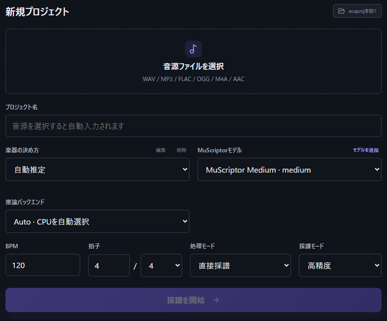
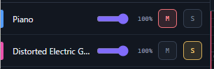
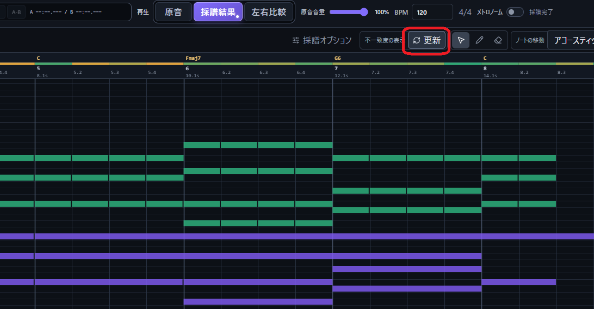
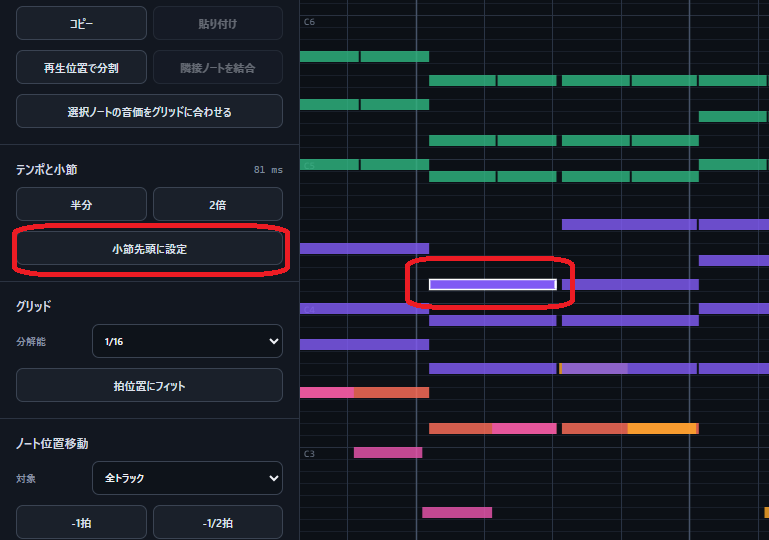
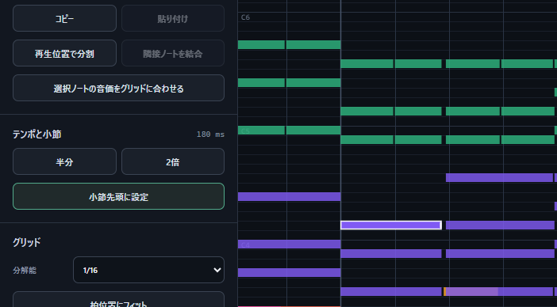
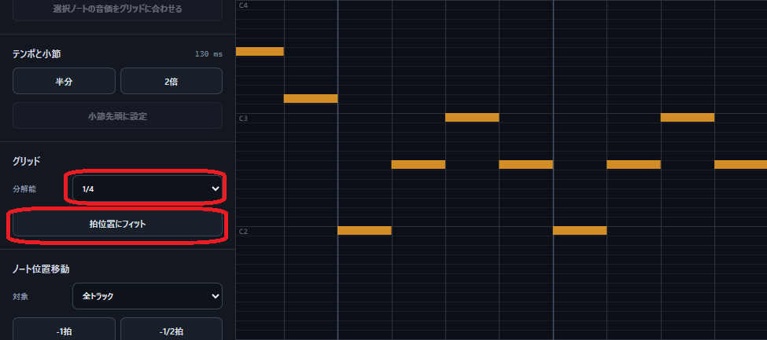
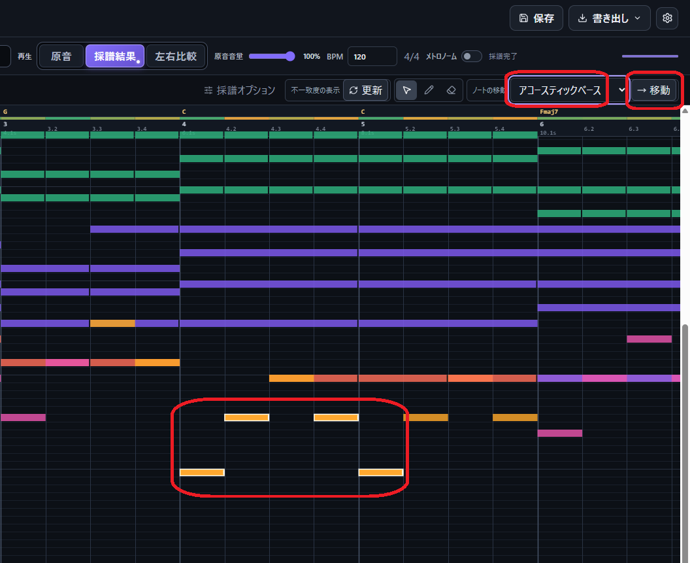
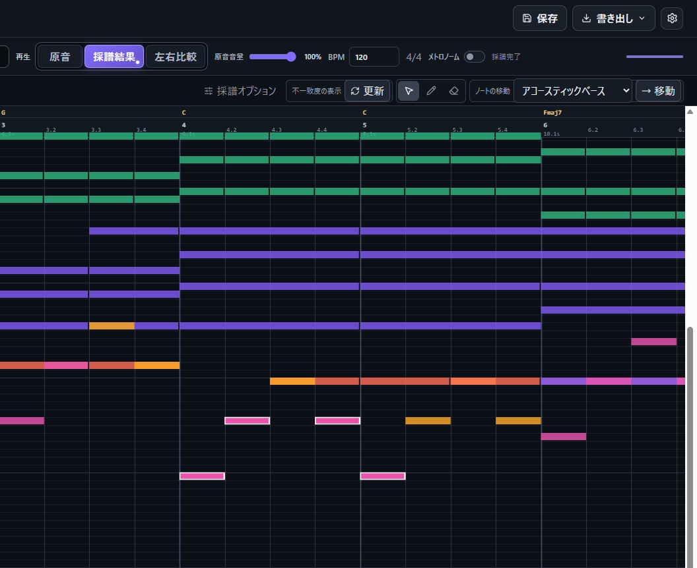

# EarCopy Assist 利用ガイド
[English](USER_GUIDE.en.md)

## 使い方

新規プロジェクト画面上部または「設定」の表示言語から、日本語、英語、中国語を選択できます。
### 採譜する

1. 「音源ファイルを選択」からWAV、MP3、FLAC、Ogg、M4A、AAC形式の音声ファイルを選びます。
2. プロジェクト名、楽器の決め方、MuScriptorモデル、処理モード、採譜モード、推論バックエンド、拍子を選択します。
3. 「採譜を開始」を選択します。

音源の選択時にBPMと小節先頭位置を推定します。  
採譜中は完了した結果から表示されます。

| 選択項目 | 推奨 | 選択肢 |
|---|---|---|
| 楽器の決め方 | 編成プリセット |「編成プリセット」は指定した楽器群を候補として採譜し、「自動推定」は最大16トラックで楽器を自動推定します。候補となる楽器を与えた方が精度が向上します |
| 処理モード | 音源分離してから採譜 |「直接採譜」はそのまま採譜し、「音源分離してから採譜」は分離した音源を個別に採譜して統合します |
| 採譜モード | 高精度 |「高速」では複数の区間を並列処理します（GPUの場合のみ）が、区間の境界で音符が途切れたり、楽器認識が変わることがあります |
| 推論バックエンド | Auto | `Auto`ではCUDAを優先し、利用できない場合はCPUを使用します |

#### 音源分離してから採譜する
原音をdrums、bass、vocals、piano、guitar、otherへ分離します。  
再生画面では各成分を選択でき、「分離WAV」では6成分を個別WAVとして保存できます。  
BS-RoFormer SW Fixedが未配置の場合は、「警告を確認してダウンロード」から取得できます。

##### 音源分離モデルを取得する

BS-RoFormer SW Fixedのモデル重みはアプリに同梱されていません。\
モデルが未配置の場合は、新規プロジェクト画面に「音源分離モデルがありません」と表示されます。\
「警告を確認してダウンロード」を押すと、アプリがモデルを取得します。  
その際、音源分離モデルのライセンスが`Unknown`であることに注意し、自己責任でご利用ください。  
配布ページにはモデル重みの利用許諾条件が明示されていません。モデルを利用する権利を確認したうえで取得してください。

1. 新規プロジェクト画面の「警告を確認してダウンロード」を押します。
2. 表示された警告と配布ページを確認します。
3. ライセンスに関する確認項目を選択します。
4. ダイアログの「警告を確認してダウンロード」を押します。

ダウンロードが完了すると、「音源分離してから採譜」を選択できます。

##### 別のBS-RoFormer重みを利用する

別のBS-RoFormer重みは、`models\\bs-roformer\\sw-fixed`へ1件だけ配置できます。\
重みファイルと、その重みに対応するYAML構成ファイルを同じフォルダーへ置いてください。\
YAMLの`training.instruments`には`drums`、`bass`、`vocals`、`other`、`piano`、`guitar`のうち、そのモデルが出力する成分名を記載します。

##### 利用可能なオプション
| 設定 | 推奨既定 | 内容 |
|---|---|---|
| 音源分離後の発音開始時刻の誤差を低減する | ON | drums波形をBass、Piano、Guitar、Vocal、Otherへ加えて採譜することで、発音位置のずれを低減します |
| 分離後音源の音量からベロシティを設定する | ON | 各音符の発音周辺の音量を測定し、採譜結果のベロシティに反映します |
| ドラム成分の追加による音高の誤検出を削減する | ON | `音源分離後の発音開始時刻の誤差を低減する` の機能が有効な場合に、drums成分を含まない音声の採譜結果を利用して採譜結果を補正します。|

`音源分離後の発音開始時刻の誤差を低減する` は新規プロジェクト画面、残りの項目は採譜完了後の「採譜オプション」で変更します。  

---

## 確認・編集
### 画面の拡大縮小
* マウスホイール：横移動
* `Ctrl`+ホイール：時間軸（横方向）
* `Shift`+ホイール：音高軸（縦方向）

### 再生
`Space`で再生／一時停止、再生位置バーのクリックまたは小節番号のクリックで再生位置を変更できます。

#### 再生モード

| モード | 出力 | 選択時のMute／Solo状態 |
|---|---|---|
| 原音 | 原音または分離音源を再生します。| 原音・分離音源を再生対象、採譜結果をMuteにし、すべてのSoloを解除します。 |
| 採譜結果 | 採譜結果を再生します。 | 採譜結果を再生対象、原音・分離音源をMuteにし、すべてのSoloを解除します。 |
| 左右比較 | 左チャンネルで原音または分離音源、右チャンネルで採譜結果を再生します。 | 両側のMuteとSoloをすべて解除します。 |

モードボタンを押すたびに、Mute／Solo状態を表の内容へ初期化します。

左右比較の場合、原音と採譜結果の再生タイミングが一致しないことがあります。  
「設定」→「再生」で音声出力デバイスと再生位置オフセットを選択できます。再生位置オフセットが正の場合は原音、負の場合は採譜結果を遅延させて調整してください。

#### Mute／Solo

* [M] は選択した採譜トラックまたは分離音源のMuteを切り替えます。
* [S] は選択した採譜トラックまたは分離音源をSoloにしてMuteを解除し、それ以外をMuteにします。

複数の採譜トラックまたは分離音源をSoloにできます。

Solo中の採譜トラックを追加でMuteできます。Solo中の分離音源も追加でMuteできます。

「左右比較」で分離音源がある場合、採譜トラックと対応する分離音源のMute／Soloは同時に切り替わります。  
分離音源がない場合、採譜トラックのMute／Soloは採譜結果の再生と表示へ適用され、原音全体の再生状態は維持されます。

採譜結果と分離音源では、それぞれ次の状態になります。

* Soloが1件以上ある場合、Solo対象ではない項目をすべてMuteにします。
* 最後のSoloを解除した場合、その一覧のMuteをすべて解除します。
* Solo対象のMuteは手動で切り替えられます。

#### 特定のパートのみを再生・表示する
[S] ボタンで採譜トラックをSoloにすると、Soloにしたパートだけを表示します。

#### リピート再生
「全体」は再生範囲の全体を繰り返します。  
A-Bリピートでは、再生位置を選択して「A」で開始位置を設定し、終了位置で「B」を設定してから「A-B」を有効にします。

### 原音との不一致度
[不一致度の表示] - [更新] を押すと、表示中の採譜結果と原音または選択中の分離音源を比較して不一致度を色分け表示できます。  
不一致度が高い箇所ほど赤色に近く、低い場所ほど緑色に近く表示されます。  
※値には原曲と採譜結果の再生音色の差も含まれるため、不一致度が高くても採譜結果が間違っているとは限りません。

### ノート編集
編集タブの「分解能」で操作時のグリッド間隔を選択します。

| 操作 | 結果 |
|---|---|
| ノートをクリック／`Shift`+クリック／空白を範囲選択 | ノートを選択／追加選択／範囲選択する |
| ノート本体をドラッグ／`←`・`→` | 時刻を移動する |
| 音程ノートを上下へドラッグ／`↑`・`↓` | 半音単位で移調する。`Shift`を加えると1オクターブ単位になる |
| ノートの左端／右端をドラッグ | 開始位置／終了位置を変更する |
| 描画ツールで空白をクリック／ドラッグ | ノートを追加する。既存ノートは選択ツールと同じ操作になる |
| 消去ツールでクリック／範囲選択、`Delete`／`Backspace` | ノートを削除する |
| `Ctrl+C`／`Ctrl+X`／`Ctrl+V` | 選択ノートをコピー／切り取り／再生位置へ貼り付ける |
| `Ctrl+Z`／`Ctrl+Y` | 編集を元に戻す／やり直す |
| 「再生位置で分割」／「隣接ノートを結合」 | 選択ノートを分割／結合する |
| 「選択ノートの音価をグリッドに合わせる」 | 選択ノートの音価（長さ）を現在の「分解能」に変更する |
| 「ノートの移動」で移動先トラックを選択して「移動」 | 選択ノートの出力トラックを変更する。音程ノートは音程トラックへ、ドラムノートはドラムトラックへ移動できる |
| 「小節先頭に設定」 | ノートを1件選択し、その開始位置が小節先頭になるように小節線と拍線の位置を変更する |
| 「拍位置にフィット」 | すべてのノートの開始位置と終了位置を、現在の「分解能」で最も近いグリッド位置へ変更する |

移動先トラックに同じ音高・同じ開始位置のノートがある場合は、終了位置が後のノートだけを残します。

編集タブでは、ノートの一括移動も実行できます。

※テンポ、拍位置、クオンタイズ、ノートの位置・音高・音価の変更は採譜完了までできません。  
　ノートの追加・削除・出力パート変更、再生、Mute、Soloは使用できます。

#### 編集例：曲の先頭を小節先頭に合わせる
1. 小節頭に揃えたい音符をクリックして選択し、「小節先頭に設定」を押します。  

2. 小節線と拍線の位置が変更され、選択した音符の開始位置が小節先頭になります。  

#### 編集例：音符の長さと開始位置をグリッドに合わせる（クオンタイズ）
1. 「分解能」を選択し、クオンタイズの細かさ（最も短い音符の長さ）を決めます。
2. 「拍位置にフィット」を押すと、すべての音符の開始位置と終了位置が「分解能」に合わせて変更されます。

※事前に、小節の先頭を正しく設定しておかないと、拍線の位置がずれてクオンタイズが正しく行われません。

#### 編集例：選択した音符を別トラック（別の楽器）に移動する
1. 移動したい音符をクリックまたは範囲選択します。
2. 移動先のトラックを選択し、「移動」を押します。

3. 選択した音符が別トラックに移動します。

## 保存・書き出し
| 出力 | 内容 |
|---|---|
| `.ecaproj` | 編集状態と採譜入力別ノートを保存する |
| MIDI Format 1 | 画面上の音符の開始位置と終了位置をMIDIで出力する |
| MusicXML 4.0 | 採譜結果を楽譜データで出力する |
| 分離WAV | drums、bass、vocals、piano、guitar、otherを出力する |

### MusicXMLの書き出し
「書き出し」→「MusicXML」で、音符の分解能、曲情報、調号、弱起、記譜方法を設定します。  
プレビュー、検査、MusicXMLには、すべての音符の開始位置と終了位置を「音符の分解能」で
クオンタイズした結果を使用します。  
検査エラーが0件になるとMusicXMLを書き出せます。  

### MIDIの書き出し
MIDIは、画面上の音符の開始位置と終了位置をそのまま使用します。クォンタイズは適用しません。

## データとキャッシュ
解析用音声、分離音源、採譜結果の最終使用時刻が新しい10件を保持し、同じ音源を採譜する際に再利用します。  
キャッシュを保存する`UserData`は`EarCopyAssist.exe`と同じ場所に作成されます。  
「設定」→「キャッシュ」で使用量の確認と選択削除ができます。

## ライセンス
EarCopy Assist本体はMIT Licenseです。  
外部ソフトウェア、再生用音源、AIモデルの利用条件は、同梱の`LICENSE.txt`、[外部ソフトウェアとモデルの利用条件・取得元](../THIRD_PARTY_NOTICES.md)、アプリ内のライセンス表示を参照してください。
