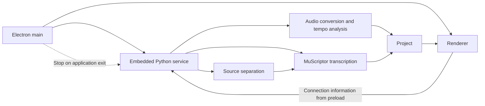

# Development Guide

[日本語](DEVELOPMENT.md)

This document defines the environment, commands, and acceptance criteria for changing and validating EarCopy Assist. See the [User Guide](../USER_GUIDE.en.md) for operation, [Transcription Methods on a Public Dataset](../TRANSCRIPTION_METHOD_BENCHMARK.en.md) for evaluation results, and the [Release and Distribution Checklist](DISTRIBUTION.en.md) for release requirements.

## Development Environment

- 64-bit Windows 10 or Windows 11
- Python 3.11
- [uv](https://docs.astral.sh/uv/)
- Node.js and npm
- Git
- A compatible NVIDIA GPU and driver for CUDA

```powershell
uv sync --extra dev

cd app
npm ci
```

Place model files used for local validation under `models/`. The three MuScriptor model weights remain outside Git and are built as self-extracting ZIP files separate from the Windows application package. Users select the parent folder of the Windows package as the extraction folder to place them under `models/muscriptor/`. The Windows application package excludes BS-RoFormer SW Fixed. When it is absent, the new-project screen displays its `Unknown` license status, distribution page, 699,412,152-byte size, destination, and SHA-256. After the user acknowledges the warning, the local Python service downloads the file into a temporary file and moves it to `models/bs-roformer/sw-fixed/` only after the size and SHA-256 match.

```text
models/
├─ muscriptor/
│  ├─ small/
│  ├─ medium/
│  └─ large/
└─ bs-roformer/
   └─ sw-fixed/
```

## Repository Structure

| Path | Responsibility |
|---|---|
| `src/earcopy_service/` | Local Python service, transcription, source separation, and export |
| `app/src/` | React interface, editing, display, and playback |
| `app/electron/` | Electron main process, preload, and embedded-service management |
| `app/packaging/` | Windows packaging configuration |
| `tests/` | Python tests and local validation data |
| `scripts/` | Build, benchmark, and pre-release validation scripts |
| `docs/` | User guides, evaluation reports, and development and distribution procedures |

## Local Execution

After installing dependencies and placing the required models under `models/`, start Electron. Electron main selects an available loopback port and starts the local Python service.

```powershell
cd app
npm start
```

## Runtime Architecture



Electron main starts the Python service as a child process on an available loopback port. The Renderer accepts only the loopback URL supplied through preload. Inference uses models under `models/`. Application shutdown terminates the embedded service process tree.

See the [User Guide](../USER_GUIDE.en.md#transcribe-after-source-separation) for the source-separation transcription procedure.

## Validation

After changing Python:

```powershell
uv run pytest -q
```

After changing the Renderer or Electron:

```powershell
cd app
npm test -- --run
npm run typecheck
```

CUDA transcription with an actual model:

```powershell
uv run python scripts/smoke_transcribe.py `
  --backend CUDA `
  --dtype float16 `
  --model models/muscriptor/small/model.safetensors `
  --audio path/to/audio.wav
```

Source separation with an actual model:

```powershell
uv run python scripts/smoke_stem_separation.py `
  --model-dir models/bs-roformer/sw-fixed
```

The public-dataset comparison procedure is in [Transcription Methods on a Public Dataset](../TRANSCRIPTION_METHOD_BENCHMARK.en.md#reproduction). Conditions and results for tempo, beat, and downbeat estimation are in the [Public Tempo, Beat, and Downbeat Evaluation](TEMPO_DOWNBEAT_EVALUATION.en.md).

## Change Checklist

- Preserve user changes that existed when work began.
- Keep regression coverage for 8 kHz, 48 kHz, and 96 kHz audio input.
- Synchronized source and separated-component playback reads 44.1 kHz stereo PCM from the same starting sample and uses one `AudioWorkletProcessor` for the same `AudioContext` frame. Mute and Solo change the gain of each PCM input without changing playback position.
- Source or separated-component playback and SoundFont playback use the same `AudioContext` and output. In L/R comparison, each signal is converted to mono before routing the source or separated components to the left and SoundFont playback to the right.
- Seeking during playback preserves the playing state and restarts PCM and SoundFont playback from the selected source time and corresponding timeline time on the same `AudioContext` start frame.
- All-repeat and A-B repeat preserve the playback states of the source, separated components, and SoundFont, then move from the repeat end to the repeat start and resume.
- Selecting a playback mode initializes Mute and Solo. Source mode enables the source and separated components and mutes transcription tracks. Transcription mode enables transcription tracks and mutes the source and separated components. L/R comparison clears every Mute and Solo state on both sides.
- Transcription tracks and separated components calculate Solo state independently. Each list supports multiple Solo selections, clears Mute on Solo items, and mutes the other items. Clearing the final Solo selection clears every Mute in that list. Mute remains available for Solo items in every playback mode.
- In L/R comparison with separated components, Mute and Solo change together for a transcription track and its corresponding separated component. Transcription tracks mapped to the same separated component form one Mute group.
- In L/R comparison without separated components, transcription-track Mute and Solo apply to SoundFont playback and piano-roll display while full-source PCM playback remains active.
- Separated transcription inputs and separated WAV export use the drums, bass, vocals, piano, guitar, and other outputs from the separation model. Drum mixing applies only to in-memory transcription input. When onset-time error reduction is enabled, add drums at 20% to Bass, Piano, Guitar, Vocal, and Other; only the drums added to Bass pass through a fourth-order Butterworth high-pass filter at 350 Hz. When onset-time error reduction is enabled, also transcribe the unmodified Bass, Piano, Guitar, and Other components and save the results as `timing_reference`, regardless of the pitch false-positive reduction setting. When pitch false-positive reduction is enabled, retain only notes whose MIDI pitch exists in the unmodified component result. If an existing project lacks `timing_reference`, transcribe only the missing unmodified components and retain the existing drum-added transcription.
- Transcription progress events report the part name, transcription-input type, step number within the part, and total steps within the part. A part transcribed once with added drums and once without added drums reports two steps.
- Velocity estimation from separated audio uses the maximum 20 ms RMS value within 200 ms after onset and maps −60 dBFS through −6 dBFS to MIDI velocity 1 through 127. Changing the setting after transcription completes uses a post-processing API whose inputs are the per-input notes and separated audio.
- Project format 5 stores notes after common post-processing and before transcription-option processing for each transcription input, together with reference notes used for pitch false-positive reduction, in `transcription.inputResults`. Changing transcription options recalculates note selection from these stored values.
- Analysis-audio, separated-audio, and transcription caches each retain the 10 most recently used entries. Reusing an entry updates its last-used time, and separated-audio entries from a different format version are deleted.
- Shutdown regression tests require zero remaining `EarCopyAssist.exe` and `earcopy_service.exe` processes.
- Confirm zero occurrences of model weights in the repository; model weights other than MuScriptor in the package; user audio; `UserData`; private keys; tokens; Windows SIDs; phone numbers; and absolute user-directory paths.
- Validation reports list each command, exit code, passed count, and failed count.

## Documentation Rules

- Use established technical terms. Define the input, processing, and output when introducing a project-specific term.
- State thresholds, tolerances, durations, capacities, ratios, and counts with numbers and units.
- User documentation describes current operations and outputs. Performance reports compare the current configuration with input conditions that demonstrate its utility.
- State available operations and their results in affirmative form in user instructions.
- Use numbered lists for procedures and processing flows whose order is significant.
- Use bullets for parallel items under one heading. Separate items with different prerequisites, processing, or results into headings, paragraphs, or tables.
- Japanese and English versions use matching heading levels, URLs, checksums, settings, and acceptance criteria.

Finally, inspect the diff and model exclusions.

```powershell
git diff --check
git ls-files models
git check-ignore -v models/muscriptor/small/model.safetensors
git check-ignore -v models/bs-roformer/sw-fixed/BS-Rofo-SW-Fixed.ckpt
```

Follow the [Release and Distribution Checklist](DISTRIBUTION.en.md) for Windows builds, corresponding source, licenses, and pre-release validation. To build the Windows package with GitHub Actions, use the standard GitHub-hosted Windows runner and `HF_TOKEN` Secret described under [Packaging with GitHub Actions](DISTRIBUTION.en.md#packaging-with-github-actions).
