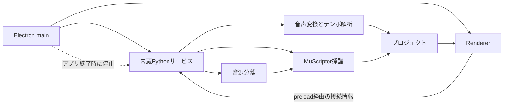

# 開発ガイド

[English](DEVELOPMENT.en.md)

この文書は、EarCopy Assistを変更・検証するための環境、コマンド、判定基準を示す。
操作方法は[利用ガイド](../USER_GUIDE.md)、方式の評価結果は
[公開データセットによる採譜方式の比較](../TRANSCRIPTION_METHOD_BENCHMARK.md)、
公開時の確認事項は[公開・配布チェックリスト](DISTRIBUTION.md)を参照する。

## 開発環境

- Windows 10またはWindows 11 64-bit
- Python 3.11
- [uv](https://docs.astral.sh/uv/)
- Node.jsとnpm
- Git
- CUDA利用時は対応するNVIDIA GPUとドライバー

```powershell
uv sync --extra dev

cd app
npm ci
```

実モデルは作業環境の`models/`へ配置する。MuScriptorの3モデルはGit追跡対象にせず、
Windows本体パッケージの`resources/models/muscriptor/`へビルド時にコピーする。
BS-RoFormer SW FixedはWindows本体パッケージへ同梱しない。
未配置の場合は、新規プロジェクト画面でライセンス`Unknown`、配布ページ、
699,412,152 bytes、保存先、SHA-256を表示する。利用者が警告を確認した後、
ローカルPythonサービスは特定コミットのURLから一時ファイルへ取得し、ファイルサイズと
SHA-256が一致した場合だけ`models/bs-roformer/sw-fixed/`へ配置する。

```text
models/
├─ muscriptor/
│  ├─ small/
│  ├─ medium/
│  └─ large/
└─ bs-roformer/
   └─ sw-fixed/
```

## リポジトリ構成

| Path | 役割 |
|---|---|
| `src/earcopy_service/` | ローカルPythonサービス、採譜、音源分離、書き出し |
| `app/src/` | React UI、編集、表示、再生 |
| `app/electron/` | Electron main、preload、内蔵サービス管理 |
| `app/packaging/` | Windows配布設定 |
| `tests/` | Pythonテストとローカル検証用データ |
| `scripts/` | ビルド、ベンチマーク、公開前検査 |
| `docs/` | 利用ガイド、評価結果、開発・配布手順 |

## ローカル実行

依存関係をインストールし、使用するモデルを`models/`へ配置した後、Electronを起動する。
Electron mainが空いているloopbackポートを選択し、ローカルPythonサービスを起動する。

```powershell
cd app
npm start
```

## 実行構成



Electron mainは空いているloopbackポートでPythonサービスを子プロセスとして起動する。
Rendererの接続先はpreload経由で渡されたloopback URLに限定する。推論処理は`models/`に
配置したモデルを使用する。アプリ終了処理は内蔵サービスのプロセスツリーを終了する。

音源分離後採譜の利用者向け操作は
[利用ガイド](../USER_GUIDE.md#音源分離してから採譜)を参照する。

## 検証

Pythonを変更した場合:

```powershell
uv run pytest -q
```

RendererまたはElectronを変更した場合:

```powershell
cd app
npm test -- --run
npm run typecheck
```

実モデルによるCUDA採譜:

```powershell
uv run python scripts/smoke_transcribe.py `
  --backend CUDA `
  --dtype float16 `
  --model models/muscriptor/small/model.safetensors `
  --audio path/to/audio.wav
```

実モデルによる音源分離:

```powershell
uv run python scripts/smoke_stem_separation.py `
  --model-dir models/bs-roformer/sw-fixed
```

公開データセットによる比較方法は
[採譜方式の比較](../TRANSCRIPTION_METHOD_BENCHMARK.md#再現手順)に記載する。
テンポ・拍・小節先頭推定の測定条件と結果は
[テンポ・拍・小節先頭推定の公開評価](TEMPO_DOWNBEAT_EVALUATION.md)に記載する。

## 変更時の確認

- 作業開始時のユーザー変更を維持する。
- 音声入力は8 kHz、48 kHz、96 kHzの回帰試験を通す。
- 原音・分離音源の同期再生では、44.1 kHzステレオPCMを同じ開始サンプル位置から読み、
  1つの`AudioWorkletProcessor`で同じ`AudioContext`フレームから再生する。Mute／Soloは
  PCM入力ごとのゲインを変更し、再生位置を変更しない。
- 原音・分離音源の再生とSoundFont再生は、同じ`AudioContext`と出力先を使用する。
  左右比較では、各信号をモノラル化した後、原音・分離音源を左、SoundFont再生を右へ
  出力する。
- 再生中に再生位置を変更した場合は再生状態を維持し、PCM再生とSoundFont再生を、
  選択した原音時刻と対応するタイムライン時刻から同じ`AudioContext`開始フレームで再開する。
- 全体リピートとA-Bリピートでは、原音、分離音源、SoundFont再生の再生状態を維持し、
  リピート範囲の終了位置から開始位置へ移動して再開する。
- 再生モード選択時はMute／Soloを初期化する。原音では原音・分離音源を再生対象として
  採譜トラックをMute、採譜結果では採譜トラックを再生対象として原音・分離音源をMute、
  左右比較では両側のMute／Soloをすべて解除する。
- 採譜トラックと分離音源は個別にSolo状態を計算する。各一覧でSoloは複数選択を許可し、
  Solo対象のMuteを解除して、それ以外をMuteにする。最後のSoloを解除した一覧はMuteを
  すべて解除する。再生モードにかかわらず、Solo対象のMute操作を許可する。
- 左右比較で分離音源が存在する場合は、採譜トラックと対応する分離音源のMute／Soloを
  同時に変更する。同じ分離音源に対応する採譜トラックは同一グループとしてMuteを変更する。
- 分離音源が存在しない左右比較では、採譜トラックのMute／SoloをSoundFont再生と
  ピアノロール表示へ適用し、原音全体のPCM再生状態を維持する。
- 音源分離後の採譜入力と分離WAVは、分離モデルのdrums、bass、vocals、piano、guitar、
  other出力を基準にする。採譜時のドラム混合はメモリ上の採譜入力だけへ適用する。
  発音開始時刻の誤差低減がONの場合はBass、Piano、Guitar、Vocal、Otherへdrumsを20%加え、
  Bassへ加えるdrumsだけに350 Hz・4次Butterworthハイパスフィルターを適用する。
  発音開始時刻の誤差低減がONの場合は、音高の誤検出削減の設定値にかかわらず、Bass、
  Piano、Guitar、Otherの分離音源単体も採譜して`timing_reference`として保存する。
  音高の誤検出削減がONの場合は、分離音源単体の採譜結果に同じMIDI音高が存在する音符だけを
  採用する。既存プロジェクトに`timing_reference`がない場合は、不足している採譜入力の
  分離音源単体だけを採譜し、ドラム成分追加後の採譜結果は再計算しない。
- 採譜進捗イベントは、パート名、入力音源の種類、パート内ステップ番号、パート内ステップ数を
  通知する。ドラム成分追加後と分離音源を各1回採譜するパートは2ステップとして表示する。
- 分離後音源からのベロシティ設定は、発音開始から200 ms以内の20 ms実効値の最大値を使用し、
  −60 dBFSから−6 dBFSまでの固定尺度でMIDIベロシティ1から127へ変換する。
  採譜完了後の設定変更は、採譜入力別ノートと分離後音源を入力とする後処理APIで完結する。
- プロジェクト形式5は、各採譜入力について共通後処理後かつ採譜オプション適用前のノートと、
  音高の誤検出削減に使用した参照ノートを
  `transcription.inputResults`へ保存する。採譜オプション変更時の音符選択は、この保存値から
  再計算する。
- 解析用音声、分離音源、採譜結果のキャッシュは、種類ごとに最終使用10件を保持する。
  キャッシュを再利用した場合は最終使用時刻を更新し、現行形式と異なる分離音源を削除する。
- 終了回帰試験はElectronと内蔵サービスの残留プロセス数が0であることを確認する。
- リポジトリのモデル重みと、配布物のMuScriptor以外のモデル重み、利用者の音源、`UserData`、秘密鍵、
  トークン、Windows SID、電話番号、利用者ディレクトリの絶対パスの検出数が0であることを
  確認する。
- 検証報告には、実行したコマンド、終了コード、成功件数、失敗件数を記載する。

## 文書作成規則

- 一般に定義された技術用語を使用する。プロジェクト固有の用語には、初出時に入力、処理、
  出力を定義する。
- 閾値、許容差、時間、容量、倍率、件数は数値と単位で記載する。
- 利用者向け文書は現在の操作と出力を記載する。性能評価では、推奨既定値と、その
  有用性を検証する入力条件を比較する。
- 利用者向け操作説明には、現在実行できる操作と、その結果を肯定形で記載する。
- 番号付きリストは、記載順に実行する手順と処理フローに使用する。
- 箇条書きは、同じ見出しに属する並列項目に使用する。前提、処理、結果が異なる項目は、
  見出し、段落、表のいずれかで分離する。
- 日本語版と英語版は、見出し階層、URL、チェックサム、設定値、判定条件を一致させる。

最後に差分とモデル除外を確認する。

```powershell
git diff --check
git ls-files models
git check-ignore -v models/muscriptor/small/model.safetensors
git check-ignore -v models/bs-roformer/sw-fixed/BS-Rofo-SW-Fixed.ckpt
```

Windows版のビルド、対応ソース、ライセンス、公開前検査は
[公開・配布チェックリスト](DISTRIBUTION.md)に従う。
GitHub ActionsでWindows版を作成する場合は、同書の
[GitHub Actionsによるパッケージ化](DISTRIBUTION.md#github-actionsによるパッケージ化)に
記載したself-hosted runnerとMuScriptorモデル供給ディレクトリを使用する。
